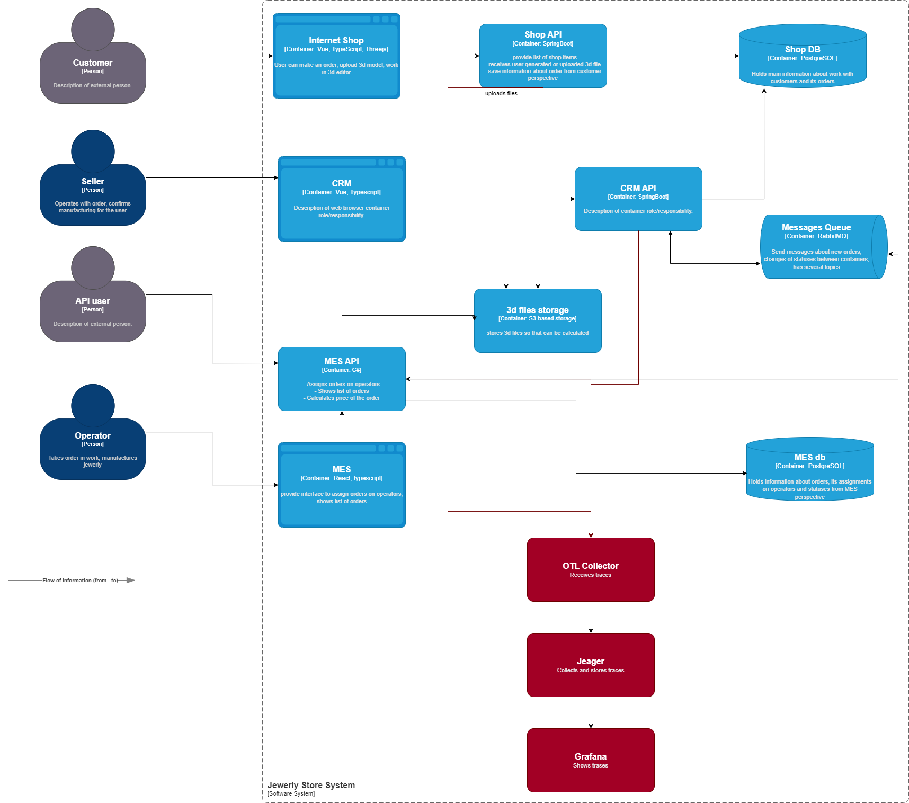

# Места потери заказа

Местом потери заказа может стать любая часть цепочки его обработки. Это заставляем подозревать все backend-приложения. 

Таки образом, трейсы необходимо собирать для:

- MES api
- Shop api
- CRM api

# Мотивация

Трейсинг поможет выявить места обрыва цепочки обработки заказа, а также наиболее медленные сегменты запроса. Потенциальные метрики, на которые могут повлиять решения, принятые на основании трейсинга:

- Отношение выполненных заказов к принятым
- Возвратность клиентов
- Прибыль

- Среднее время запроса
- Процент запросов с ошибками

# Предполагаемое решение

- Отправка трейсов с приложений в OTL коллектор (по аналогии с метриками)
- Экспотр в Jeager
- Вывод в графану

# Компромиссы

При текущей архитектуре проблемы могут возникнуть с встраиванием трейсинга в MES, так как система писалась не командой разработчиков компании.

Так как RabbitMQ не отправляет трейсы в коллектор, при возникновении проблем на стороне очереди, зафикировать обрыв цепочки не удастся.

# Безопасность

- Observability стек необходимо развернуть во внутренней сети.
- Доступ к коллектору и джагеру должен быть только у настраивающих его DevOps специалистов.
- Доступ к интерфейсу графаны - только DevOps и разработчиков. 

