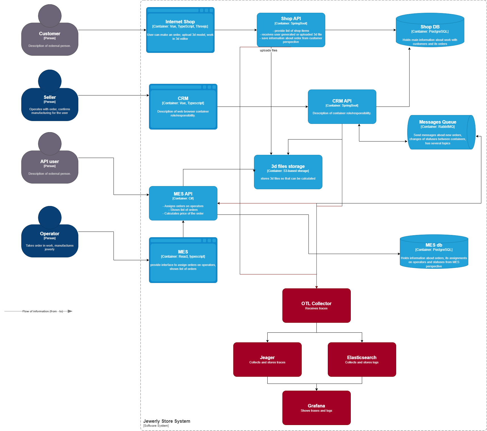

# INFO логи

Основной проблемой является потеря заказов в системе. Помимо явных ошибок, система может иметь "логические дыры", поэтому необходимо логгировать цепочку изменения заказа. Основными событиями для логгирования могут стать следующие:

- создание заказа
- смена статуса заказа

# ERROR логи

Помимо логгирования успешных процедур, необходимо фиксировать провальные. Места, покрытые логами INFO, можно также покрыть логами ERROR для выявления "технических" дыр обработки заказа.

Также необходимо логгировать ошибки запросов, для того, чтобы информация об ошибке из трейсинга дополнялась конкретными сведениями из лога.

# Типы логов в разных средах

В prod, release имеет смысл оставить логи от INFO до FATAL. В dev для отладки можно оставить debug, trace.

# Мотивация

Логгирование позволит детально узнать причины ошибок, возникающих в приложении. Метрики, на которые может повлиять (те же, что и при трейсинге, так как решаем одни проблемы):

- Отношение выполненных заказов к принятым
- Возвратность клиентов
- Прибыль

- Среднее время запроса
- Процент запросов с ошибками

# Предлагаемое решение

- Логгирование в stdout
- Сбор логов с контейнера в OTL коллектор
- Экспорт в Elasticsearch
- Вывод в графану

- Чувствительные данные не логгируются.
- Доступ к Elasticsearch имеет только DevOps
- Доступ к интерфейсу графаны - только DevOps и разработчики.

- Шарды по 10–50 ГБ (оптимальный средний диапазон)
- Срок хранения - 3 месяца (меньший срок не даст возможности разобраться с проблемой, больший - забьет памать)

- Дашборд по переходам заказа в другой статус (можно увидеть расхождения в случае неперехода)
- Алерт на ошибки создания заказа (возможность среагировать и добавить заказ руками + доработать систему, исправив ошибки или реализовав failover-логику)
- Алерт на ошибки перехода заказа в другой статус (возможность среагировать и продвинуть заказа руками + доработать систему, исправив ошибки или реализовав failover-логику)

