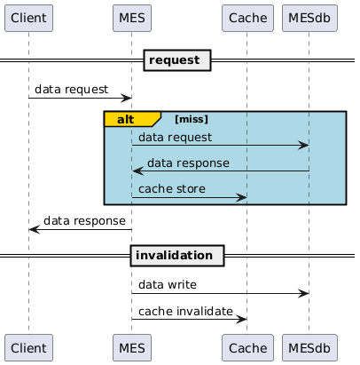

# Что кэшируем

Так как имеется конкретная проблема со скоростью загрузки страницы заказов со статусами с MES, кэшировать необходимо именно данные запросы.

# Мотивация

Внедрение кэширования поможет сократить время загрузки страницы с заказами, что в свою очередь уменьшит время обработки заказа, дав возсожность обрабатывать большее количество заказов.

# Предлагаемое решение

Ввиду объема данных и их идентичности для разных пользователей следут выбрать серверное кэширование.

Паттерн cache-aside с инвалидацией кэша по ключу (id заказа).

Cache-aside выбран для гарантии доступа к бд в случае отказа кэша и для реализации кэширования на стороне сервиса.

Инвалидация по ключу обусловлена тем, что кэшируются запросы конкретного содержания, а значит можно обновлять кэш ровно тогда, когда обновится кэшируемая информация, поддерживая тем самым актуальность данных в кэше (не выставляем ttl) и не затрачивая ресурсы на обновление без необходимости. Так как мы кэшируем запрос на список заказа по статусам, кэш можно обновлять при изменении статуса закэшированного заказа (как при запросе с клиента, так и при обработке события из очереди).

Минусы альтернативных решений

- Read-through - риск отсутствия доступа к бд при потери кэша
- Refresh-ahead - задержка в обновлении, временная неактуальность данных
- Инвалидация по ttl - задержка в обновлении, временная неактуальность данных
- Инвалидация по запросам - статусы меняются в том числе в рамках событий из очереди

